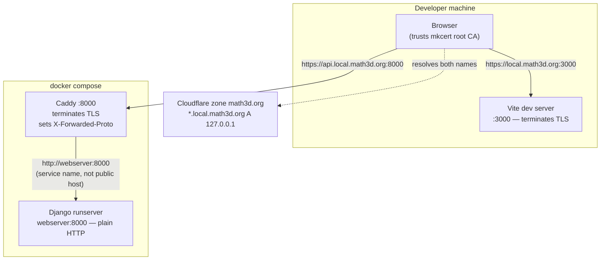

# 0005 — Local HTTPS development environment

**Status:** Accepted (2026-09-02)

**Contents**

- [Context](#context)
- [Decision](#decision)
  - [Resolution: public DNS records](#resolution-public-dns-records)
  - [Trust: a local CA](#trust-a-local-ca)
  - [One certificate for every port](#one-certificate-for-every-port)
  - [Terminating TLS](#terminating-tls)
  - [Secure cookies follow the scheme](#secure-cookies-follow-the-scheme)
  - [The Google client](#the-google-client)
  - [CI stays on HTTP](#ci-stays-on-http)
  - [CA key hygiene](#ca-key-hygiene)
- [Prior art](#prior-art)
- [Consequences](#consequences)
- [Alternatives considered](#alternatives-considered)

## Context

[ADR-0004](0004-oauth-only-authentication.md) put sign-in behind Google, and recorded that the real flow cannot be exercised locally: Google exempts only bare `localhost` from its HTTPS requirement, and separately requires the host's TLD to be on the public suffix list, so `http://math3d.localdev:3000` fails on both counts.[^redirect-uri] The consequence is that production is the only place the Google button has ever been clicked — and that is part of why ADR-0004 opened `ENABLE_REGISTRATION` there, since "there is no other way to exercise the real Google flow".

Development deliberately mirrors production's cookie arrangement: SPA and API on separate hosts under a shared registrable domain, so `CSRF_COOKIE_DOMAIN` does real work rather than sitting inert. Moving both servers to bare `localhost` would satisfy Google and give that up in the same move. The remaining option ADR-0004 named — "terminating TLS locally for a domain math3d owns" — is what this ADR decides.

Two goals, then: a local environment that keeps production's cookie shape, and one where the Google button works.

## Decision

Serve local development from `https://local.math3d.org:3000` (SPA) and `https://api.local.math3d.org:8000` (API).

Two independent questions hide inside that: how the names resolve, and who signs the certificate. They are decided separately because they have separate failure modes and separate exit conditions.



### Resolution: public DNS records

`local.math3d.org` and `*.local.math3d.org` get A records pointing at `127.0.0.1`, DNS-only, in the Cloudflare zone math3d already owns. No `/etc/hosts` entry on any machine, in any worktree, ever.

`ol-infrastructure/local-dev` solves the same problem with a marker-delimited `/etc/hosts` block, and it is worth being explicit about why this ADR goes the other way rather than following a precedent that works. That setup defaults to `mit.dev`, a domain the team does not control records for, across many developers including WSL — with no zone to edit, a `sudo`-written hosts block is the only option available. It pays for that: hostnames must be enumerated by hand, because a hosts file has no wildcards.

We own the zone, so the wildcard is available, and it is what makes future hostnames free. Adding one costs no DNS edit, no certificate reissue, no `sudo`, and no re-run on a new machine or in a new worktree. Pointing a public name at loopback is well-trodden — `lvh.me` and `localtest.me` are the same trick on domains we do not control.

The cost is that resolution now needs the network. The setup script therefore emits the equivalent hosts block under `--write-hosts` for offline work; it is a fallback, not the default path.

### Trust: a local CA

The certificate comes from a **mkcert** CA installed in this machine's trust store, not from a publicly-trusted issuer.

A public certificate is obtainable — the names are in a real zone, so Let's Encrypt would issue over DNS-01 — but it drags in the whole ACME apparatus for a host that only ever answers to loopback: a Cloudflare API token with edit rights on the production zone, a custom Caddy build carrying the DNS plugin (the stock image has no DNS solvers), 90-day renewals that fail silently on a laptop that was closed, and a genuine private key living in the working tree where `detect-secrets` will keep finding it.

mkcert has none of that, and installing a root into a trust store is a solved, scriptable problem — `ol-infrastructure/local-dev` does it unattended for a whole team, Windows included. The one step that cannot be containerized is `mkcert -install`, because it writes to the _host's_ trust store, which is what the browser reads.

Revisit this if a collaborator joins, or if the flow ever needs testing from a phone or from CI, where the root cannot be installed.

### One certificate for every port

Ports are not part of a certificate. One leaf covering `local.math3d.org` and `*.local.math3d.org` therefore serves the main checkout on `:3000` and every worktree dev server on `:3002`–`:3009` (`WORKTREE_PORTS` in `webserver/main/origins.py`) with nothing per-worktree to generate.

The certificate lives **machine-global**, under `~/.local/share/math3d/certs/`, rather than in a gitignored `certs/` beside the code. A repo-local path would mean one mkcert run per checkout, which is the wrong shape for a repo where worktrees are created routinely and often driven by agents: any checkout that skipped setup would fail at dev-server start for a reason that looks nothing like its cause. One generation per machine, and every checkout — present and future — picks it up. Caddy bind-mounts the directory by absolute path.

### Terminating TLS

**Vite terminates its own TLS** via `server.https`, pointed at the mkcert files. The SPA needs no proxy in front of it, and `packages/app/vite.config.ts` already derives host and port from `APP_BASE_URL`, so the scheme joins them as a third derived value. A missing certificate fails the server start with a message naming the setup script, in the spirit of the existing `strictPort` comment: fail loudly rather than silently serve something subtly wrong.

**Django gets a Caddy container**, because `runserver` cannot terminate TLS. Caddy is the right shape here rather than merely an available one: production terminates TLS at Heroku's router and Django reads `X-Forwarded-Proto` behind it, so a local reverse proxy reproduces the deployed topology instead of approximating it.

That makes `SECURE_PROXY_SSL_HEADER` — today set only in the production branch of `settings.py:94-95` — necessary in development too. Without it Django sees plain HTTP behind Caddy: `request.is_secure()` is false and every absolute URL it builds says `http`.

The Caddyfile **matches on the public hostname and forwards to the Docker service name**:

```
api.local.math3d.org:8000 {
    tls /certs/local.math3d.org.pem /certs/local.math3d.org-key.pem
    reverse_proxy webserver:8000
}
```

The asymmetry is load-bearing. Hostnames resolve per-machine, and inside a container `api.local.math3d.org` is that container's own loopback — `reverse_proxy api.local.math3d.org:8000` would proxy Caddy to itself. The same rule governs any server-side fetch from Django, and it is what production does too: the browser reaches `api.next.math3d.org`, while Heroku's router reaches the dyno internally rather than re-resolving the public name.

Caddy sits behind a compose **profile**, and `webserver`'s published port becomes `${WEBSERVER_HOST_PORT:-8000}`. Both default to today's behaviour, so CI — which runs `docker compose up` from the same file — is untouched by a file it now shares with a service it never starts.

### Secure cookies follow the scheme

Development currently forces `SESSION_COOKIE_SECURE` and `CSRF_COOKIE_SECURE` to `False` (`settings.py:102-103`). Over HTTPS they are derived from the `APP_BASE_URL` scheme instead, so local development runs the same cookie flags production does.

Leaving them `False` would have worked — `Secure` cookies are a browser-side restriction, and nothing about the Google flow needs them. The reason to flip them is that the cookie arrangement is the one part of production this environment exists to mirror faithfully, and `Secure` is the last attribute it was not exercising. A dev environment that reproduces the domain scoping but not the flags still cannot catch a cookie that production would refuse to send.

This forces a second change, and the coupling is the interesting part. The `DISABLE_ALLAUTH_RATE_LIMITS` guard at `settings.py:281-284` refuses to boot when `SESSION_COOKIE_SECURE` is set, using that flag as a stand-in for "this is production". Two distinct policies are aliased onto one setting, and they only ever agreed because development happened to be plaintext. It is re-keyed to `not IS_DEVELOPMENT`, which is what it always meant.

**This weakens an argument in ADR-0004 and should be recorded as such.** That ADR justified registering the `dummy` provider under `IS_DEVELOPMENT` on the grounds that "production cannot set that flag without simultaneously turning off secure cookies, HSTS, and TLS redirection, and dropping the required-config guards". After this change, `IS_DEVELOPMENT` no longer implies insecure cookies. The other three legs stand — `SECURE_SSL_REDIRECT`, HSTS, and the required-config guards remain strictly production-side — so the conclusion holds on a narrower base. It is worth knowing the base got narrower.

### The Google client

A **dev-only OAuth client**, in the same Google Cloud project as production. Separate client because development origins churn — worktree ports, hostname changes like this one — and every such edit would otherwise be a change to the client real users authenticate against, one mis-click from deleting a production origin. Same project because the consent screen, its branding, and its publishing status are per-project, and a second project would mean configuring and possibly re-verifying a second one.

Authorized JavaScript origins list `https://local.math3d.org:3000` and each of `:3002`–`:3009`. Non-standard ports are permitted in a JavaScript origin,[^ports] so no privileged bind is needed and worktrees are registerable on the same terms as the main checkout. Registering all nine up front costs nothing and means a worktree's sign-in button never fails for a reason unrelated to the work in progress.

No redirect URI and no client secret, per ADR-0004: the popup flow obtains no authorization code, so neither field has a consumer.

The dev client ID is committed to `.env.development`, replacing the placeholder. A client ID is public by construction — it ships inside the SPA bundle — and its only security property is the origin allowlist, whose entries resolve to loopback for everyone. Committing it means a fresh checkout gets a working Google button from the setup script alone, rather than carrying "create your own OAuth client" as a documented prerequisite. It cannot reach a production build: `deploy-reusable.yml` supplies `VITE_GOOGLE_CLIENT_ID` from a GitHub Actions variable, and the E2E workflow hardcodes its own.

### CI stays on HTTP

CI takes `APP_BASE_URL`, `TEST_APP_URL`, and `TEST_API_URL` from Actions variables and writes its own `.env`, so it is already insulated from `.env.development` and needs no change. It stays on `.localdev` over HTTP deliberately: moving it to the HTTPS origin would mean distributing the CA private key to runners as a rotating secret, which is a real credential in exchange for no additional coverage — the suite authenticates through `dummy`, not Google.

### CA key hygiene

A trusted root's private key can mint a certificate for **any** hostname this machine's browsers will accept silently. Two attackers are worth separating: live malware running as the user, which is largely game-over regardless, and **backup exposure** — a stolen disk, a compromised backup provider — which needs no code execution at all and is defeated by rotation.

So the setup rotates the CA rather than reusing an existing one, excludes `$(mkcert -CAROOT)` from Time Machine, and parks `rootCA-key.pem` offline once the leaf is issued. Order matters: rotating without first untrusting the old root gains nothing, because the backed-up old key still signs certificates this machine accepts. `rootCA.pem` stays in place — only issuance needs the private half, and mkcert leaves are long-lived.

## Prior art

Wanting real origins over HTTPS locally is a thoroughly solved problem, and most of this ADR assembles existing pieces rather than inventing any. The off-the-shelf options were evaluated on whether they preserve production's cookie shape, since that is the constraint that eliminates most of them.

**Shared public domains pointing at loopback.** `lvh.me`, `localtest.me`, and the wildcard-DNS services `nip.io` / `sslip.io`[^sslip] resolve to `127.0.0.1` (or to any IP encoded in the name) with no setup at all. `localhost.direct`[^lhd] goes further and is the closest thing to a turnkey answer: its author holds a **publicly trusted wildcard certificate** and publishes the private key, so there is no local CA to install anywhere.

They are rejected for the same reason `localhost` is. Cookies would be scoped to somebody else's registrable domain — `.localhost.direct`, shared with every other developer using the service — rather than to one math3d controls, which is precisely the fidelity this environment exists to provide. `localhost.direct` carries a second problem: a deliberately published private key is a mandatory revocation event under CA/Browser Forum rules, so the certificate is one complaint away from disappearing, and its continued existence depends on one volunteer renewing it. The `sslip.io` family also offers no wildcard certificate, leaving the trust half unsolved.

**Caddy's own local CA.** `tls internal` plus `caddy trust`[^caddy-internal] does what mkcert does — generates a CA, installs it into the local trust store — and this design already runs Caddy, so it is the option most obviously worth taking.

It loses on where the files end up. Vite needs the leaf as a **pair of files on the host** it can hand to `server.https`; Caddy keeps its PKI inside its own data directory, which here is a container path backed by a Docker volume, so the certificate is both awkward to hand to Vite and destroyed by `docker compose down -v`. `caddy trust` installs into the trust store of whatever machine it runs on, which for a containerized Caddy is the container's — so the one step that actually matters would have to be done by hand on the host anyway. mkcert writes plain files to a host path that Vite reads directly and Caddy bind-mounts, and automates the host trust install that is the whole difficulty.

**`vite-plugin-mkcert`.**[^vite-mkcert] Wraps mkcert for Vite specifically and would cover the SPA in one line. It only covers the SPA, though: Caddy needs the same certificate for the API host, and the certificate here is deliberately machine-global and shared across worktrees, which is not the lifecycle a per-project plugin manages. The plugin would be solving the easy half.

**Tunnels — `cloudflared`, ngrok.** A different shape entirely, and the strongest alternative. A named Cloudflare Tunnel[^cf-tunnel] would map `local.math3d.org` to `localhost:3000` with a genuinely trusted certificate terminated at Cloudflare's edge: no local CA, no hygiene section, no trust install, and it works from a phone — all on infrastructure math3d already uses.

It is not taken because it changes what is being tested. Every request, including every HMR update, leaves the machine and round-trips through Cloudflare, making an internet dependency out of a workflow that a DNS record only needs at resolution time. The local dev server becomes internet-reachable unless Cloudflare Access is configured in front of it. Each worktree port needs its own hostname and ingress rule, which spends the "one certificate, every port" property this design gets for free. And TLS terminates at an edge whose forwarded-header behaviour is Cloudflare's rather than a proxy we configure, which is the fidelity argument in [Terminating TLS](#terminating-tls) running backwards.

ngrok-style ephemeral tunnels fail on a narrower point: a hostname that changes per run would need re-registering as a Google authorized origin every session.

The tunnel is the right thing to revisit if a collaborator joins or a phone needs to reach the environment — the same trigger as the publicly-trusted-certificate option, and probably the better answer when it arrives.

## Consequences

- **mkcert becomes a prerequisite for running a dev server at all,** not just for testing Google. The setup script is idempotent and the certificate is machine-global, so the cost is once per machine — but a checkout on a fresh machine cannot `yarn start` until it runs.
- **The dev servers are unreachable from other devices.** A phone on the same network resolves `local.math3d.org` to its own loopback, and could not trust the root anyway. Mobile testing against local dev is gone; it was already impractical over `.localdev`.
- **Offline development needs the hosts fallback,** one `--write-hosts` invocation, undoing part of what the DNS decision buys.
- **The zone publicly records that this setup exists,** and the names resolve to `127.0.0.1` for the entire internet. Both are true of `lvh.me`; neither grants access to anything.
- **ADR-0004's `dummy`-provider argument rests on a narrower base,** as described above.
- **Worktree `.env` files generated before this change carry the old hostnames** and will not pick up HTTPS until regenerated; `scripts/setup_worktree_env.sh` also matches ports against the literal `math3d.localdev` and must change with them.
- **Google's console is now load-bearing for a local workflow.** Nine authorized origins are configuration living outside the repo, discoverable only by failing.

## Alternatives considered

- **mkcert on the existing `.localdev` names.** By far the cheapest — a scheme change and nothing else, no DNS, no new hostnames. Dead on the public-suffix rule, which rejects the redirect/origin regardless of transport. `*.localhost` subdomains (`app.localhost:3000`) fail identically; Google's HTTP exemption covers only bare `localhost`.
- **Both servers on bare `localhost`.** Google-legal with zero infrastructure, and cookies ignore ports so the session cookie is shared for free. Rejected because it abandons the shared-registrable-domain arrangement, leaving `CSRF_COOKIE_DOMAIN` — exactly the machinery the OAuth work touches — unexercised locally. It remains the fallback if this stalls, and costs nothing to add as an extra origin.
- **A publicly-trusted certificate via DNS-01.** See [Trust](#trust-a-local-ca). Worth revisiting only when a device that cannot install the root needs to reach the dev server.
- **`runserver_plus --cert-file` (django-extensions).** No new service and no `SECURE_PROXY_SSL_HEADER`, which is precisely the objection: production runs Django behind a TLS-terminating router reading forwarded headers, and this quietly diverges from that topology to save a container.
- **A name-constrained CA.** X.509 `nameConstraints` limiting the root to `.math3d.org` would reduce "can forge anything" to "can forge our own dev hostnames" — a real improvement on the hygiene section's whole premise. mkcert cannot generate one; it needs `openssl` or `step-ca`. Believed enforced by Apple's verifier, NSS, and Chrome's built-in verifier for user-added roots, but unverified, and the fallback if enforcement is missing is silent. Not taken.
- **`/etc/hosts`, as `ol-infrastructure/local-dev` does.** See [Resolution](#resolution-public-dns-records).

[^redirect-uri]: [Google Identity — Redirect URI validation rules](https://developers.google.com/identity/protocols/oauth2/web-server#uri-validation): the host TLD must belong to the public suffix list, and HTTPS is required except for `localhost`.
[^ports]: [Google Cloud — Manage OAuth Clients](https://support.google.com/cloud/answer/15549257): "If you use a port other than 80, you must specify it. For example: `https://example.com:8080`".
[^sslip]: [nip.io](https://nip.io/) / [sslip.io](https://sslip.io/) — wildcard DNS returning the IP address encoded in the hostname.
[^lhd]: [`Upinel/localhost.direct`](https://github.com/Upinel/localhost.direct) — `*.localhost.direct` resolving to `127.0.0.1`, with a publicly trusted wildcard certificate and its private key published for anyone to use.
[^caddy-internal]: [Caddy — Automatic HTTPS](https://caddyserver.com/docs/automatic-https#local-https): Caddy generates its own CA, signs leaf certificates with it, and stores the PKI under its data directory; `caddy trust` installs the root into the local trust store.
[^vite-mkcert]: [`vite-plugin-mkcert`](https://github.com/liuweiGL/vite-plugin-mkcert).
[^cf-tunnel]: [Cloudflare — Create a locally-managed tunnel](https://developers.cloudflare.com/cloudflare-one/networks/connectors/cloudflare-tunnel/do-more-with-tunnels/local-management/create-local-tunnel/).
