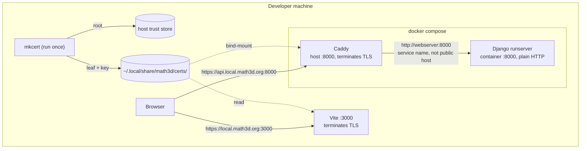

# 0005 — Local HTTPS development environment

**Status:** Rejected (2026-09-03)

**Contents**

- [Context](#context)
- [Decision](#decision)
  - [What would reverse this](#what-would-reverse-this)
- [The rejected design](#the-rejected-design)
  - [Public DNS, not /etc/hosts](#public-dns-not-etchosts)
  - [A local CA](#a-local-ca)
  - [Terminating TLS](#terminating-tls)
  - [Configuration that would move](#configuration-that-would-move)
  - [The Google client](#the-google-client)
  - [The CA private key](#the-ca-private-key)
  - [What implementing it would take](#what-implementing-it-would-take)
- [Consequences](#consequences)
- [Alternatives considered](#alternatives-considered)

## Context

[ADR-0004](0004-oauth-only-authentication.md) put sign-in behind Google and recorded that the flow cannot be exercised on today's development hostnames: Google requires the host's TLD to be on the public suffix list and requires HTTPS outside bare `localhost`,[^origins] so `http://math3d.localdev:3000` fails on both counts. It named the two ways out — move both servers onto `localhost`, or terminate TLS locally for a domain math3d owns — and deferred the choice to here.

The rules are the same under either OAuth flow. Google's redirect-URI validation carries the identical pair of constraints,[^redirect-uri] so migrating from the popup to a redirect would neither rescue `.localdev` nor force HTTPS; the choice below does not need revisiting when that migration happens.

Bare `localhost` needs no infrastructure and no code: `settings.py:104-107` already lists it in the development `ALLOWED_HOSTS`, `dev_cors_allowed_origins` derives every CORS and CSRF origin from `APP_BASE_URL`, and `EnvConfig._csrf_cookie_domain_must_cover_spa_host` skips its check when `CSRF_COOKIE_DOMAIN` is empty. What it leaves is a _mode_: a configuration entered to test Google and left to do anything else, alongside the `.localdev` hostnames daily development and the E2E suite use.

The alternative is to stop having two hostname sets at all, which is what this ADR proposed.

## Decision

**Rejected.** Local development stays on `http://math3d.localdev:3000` and `http://api.math3d.localdev:8000`. Exercising Google sign-in by hand means pointing `APP_BASE_URL` and `VITE_API_BASE_URL` at `localhost`, clearing `CSRF_COOKIE_DOMAIN` in the gitignored `.env`, and registering `http://localhost:3000` as an authorized JavaScript origin. That procedure belongs with the OAuth work, not here.

The design below is sound, and its benefit is real: one set of hostnames shared by daily development, the E2E suite, and a real sign-in, instead of a mode someone has to remember exists. What it cannot carry is its price against how often the need arises. Standing it up costs a `mkcert -install` that writes to the system keychain and prompts for administrator credentials — so a human must run it once per machine, and an agent cannot; a Caddy container in front of Django; two DNS records; `NODE_EXTRA_CA_CERTS` threaded through the E2E suite permanently; a certificate that expires silently around two years out; and every worktree created before the change broken rather than degraded. Exercising Google sign-in by hand is a deliberate, occasional act — a few sessions a year, not a daily loop. Uniformity is worth paying for in proportion to how often the seam is crossed, and this seam is crossed rarely.

The cost accepted in exchange is that the mode is machine-global rather than local. One Django container serves the main checkout and every worktree, and `dev_cors_allowed_origins` derives the whole trusted set from `APP_BASE_URL`, so while `localhost` is in effect the worktree frontends on `math3d.localdev:3002`–`:3009` fall out of CORS and their SPAs cannot read `csrftoken`. That is tolerable precisely because the mode is entered deliberately and briefly; it would not be if Google testing were routine.

### What would reverse this

- **A collaborator joins.** A second machine pays the switch too, worktree breakage compounds across people, and "the mode is entered deliberately" stops being something one person can guarantee.
- **Google testing becomes routine** rather than occasional — most plausibly if a second provider lands and provider-specific behaviour needs hand-checking on a regular cadence.
- **The mode causes a confusing failure in practice** — an E2E run or a worktree failing with an opaque CORS or CSRF error because `localhost` was left in effect.
- **The flow needs testing from a device that cannot install a root certificate,** such as a phone. A tunnel beats this design for that case; see [Alternatives](#alternatives-considered).

## The rejected design

Serve local development from `https://local.math3d.org:3000` (SPA) and `https://api.local.math3d.org:8000` (API), on a certificate from a local CA. The reason it can be a single environment rather than a mode is that the hostnames live under a domain math3d owns.

Two independent questions follow: how the names resolve, and who signs the certificate.



### Public DNS, not /etc/hosts

`local.math3d.org` and `api.local.math3d.org` get A records pointing at `127.0.0.1`, DNS-only, in the Cloudflare zone math3d already owns — two explicit records, not a wildcard, since nothing needs a third name yet. No `/etc/hosts` entry on any machine or in any worktree, which would retire the `sudo` step in `README.md`.

`ol-infrastructure/local-dev` uses a marker-delimited `/etc/hosts` block because it defaults to `mit.dev`, a domain the team holds no zone for; a hosts file has no wildcards, so its eight hostnames are enumerated by hand. Owning the zone is what makes records the cheaper option here — nothing to install, nothing to re-run on a new machine or in a new worktree. Pointing a public name at loopback is well-trodden: `lvh.me` and `localtest.me` are the same trick on domains we do not control.

The cost is that resolution needs the network, so the setup script would emit the equivalent hosts block under `--write-hosts`.

### A local CA

The certificate comes from a **mkcert CA installed in this machine's trust store**, not from a publicly trusted issuer.

Let's Encrypt would issue over DNS-01, since the names are in a real zone. That buys the whole ACME apparatus for a host that only answers to loopback: a Cloudflare API token with edit rights on the production zone, a custom Caddy build carrying a DNS solver (the stock image has none), 90-day renewals that fail silently on a closed laptop, and a real private key in the working tree for `detect-secrets` to keep finding.

One leaf covers both hostnames and therefore every port — ports are not part of a certificate — so the main checkout on `:3000` and worktree servers on `:3002`–`:3009` share it. It lives machine-global under `~/.local/share/math3d/certs/`, not in a gitignored `certs/` beside the code: a repo-local path means one mkcert run per checkout, and a worktree that skipped it fails at dev-server start for a reason that looks nothing like its cause.

### Terminating TLS

**Vite terminates its own TLS** via `server.https`. The SPA needs no proxy, and `packages/app/vite.config.ts:67` already derives host and port from `APP_BASE_URL`, so the scheme joins them as a third derived value. Reading the certificate must be scoped to an https `APP_BASE_URL` and to `command === "serve"`: that file is also the vitest config, and `yarn test` and `yarn build` run in CI where no certificate exists.

Django gets a Caddy container, because `runserver` cannot terminate TLS and because production terminates at Heroku's router with Django reading `X-Forwarded-Proto` behind it. That makes `SECURE_PROXY_SSL_HEADER` — today production-only, `settings.py:95` — necessary in development too. The consequence is specifically about CSRF, not about URL building: Django's `CsrfViewMiddleware` composes its same-origin comparison from `request.is_secure()` and runs the strict `Referer` check _only_ for secure requests,[^csrf] so without the header development exercises a different code path than production.

The Caddyfile matches on the public hostname and forwards to the Docker service name:

```
api.local.math3d.org:8000 {
    tls /certs/local.math3d.org.pem /certs/local.math3d.org-key.pem
    reverse_proxy webserver:8000
}
```

Inside a container `api.local.math3d.org` is that container's own loopback, so `reverse_proxy api.local.math3d.org:8000` would proxy Caddy to itself. The same rule governs any server-side fetch from Django, and production works the same way: the browser reaches `api.next.math3d.org` while Heroku's router reaches the dyno internally.

Caddy takes host `:8000` behind a compose profile, and `webserver`'s published port becomes `${WEBSERVER_HOST_PORT:-8001}` so the two cannot collide. Both variables live in the **gitignored project-root `.env`**, because compose interpolation reads only that file and the shell — never the `env_file:` list, which is a different mechanism — so `.env.development` cannot carry them.

### Configuration that would move

`.env.development` moves `APP_BASE_URL`, `VITE_API_BASE_URL`, `VITE_SITE_ORIGIN`, `TEST_APP_URL`, and `TEST_API_URL` to the new origins, and `CSRF_COOKIE_DOMAIN` to **`local.math3d.org`** — not `math3d.org`, which the validator would also accept while attaching development cookies to production requests. CORS, CSRF-trusted, and credentialed origins derive from `APP_BASE_URL` in `webserver/main/origins.py`, so they follow for free, worktree ports included. Two consumers do not:

- `ALLOWED_HOSTS`. The development default at `settings.py:104-107` is `["localhost", "127.0.0.1", "api.math3d.localdev"]`, and Caddy preserves the incoming `Host`, so Django rejects every API request with `DisallowedHost` until `api.local.math3d.org` is added.
- **Node does not read the macOS trust store.** Playwright's `webServer` readiness probe, `global.setup.ts`'s `request.get`, and — the one no Playwright option reaches — the bare `fetch` calls in `packages/app-tests-e2e/src/utils/api/config.ts` all validate against Node's bundled CA bundle. The fix is `NODE_EXTRA_CA_CERTS` on the `test-e2e` script, which already wraps Playwright in a `node` invocation. `ignoreHTTPSErrors` is not the fix: it would discard the trust the design exists to establish.

CI stays on `.localdev` over HTTP throughout. It takes `APP_BASE_URL` and the `TEST_*` URLs from Actions variables and writes its own `.env`, so it is already insulated from `.env.development`; moving it would mean shipping the leaf key to runners as a rotating secret and installing the root in each runner's trust store, for no additional coverage — the suite authenticates through `dummy`, not Google.

### The Google client

A **dev-only OAuth client**, in the same Google Cloud project as production. Separate client because development origins churn, and every such edit would otherwise touch the client real users authenticate against. Same project because the consent screen, its branding, and its publishing status are per-project. Authorized JavaScript origins list `https://local.math3d.org:3000` and each of `:3002`–`:3009`; non-standard ports are permitted in a JavaScript origin,[^origins] so no privileged bind is needed and worktrees register on the same terms as the main checkout. No redirect URI and no client secret, per ADR-0004 — the popup flow obtains no authorization code, so neither field has a consumer.

This part survives the rejection: a dev-only client is right under either decision, and `http://localhost:3000` is registered on it.

### The CA private key

A trusted root's private key mints certificates for _any_ hostname this machine accepts silently. Live malware running as the user is game-over regardless; backup exposure — a stolen disk, a compromised backup provider — needs no code execution and is the case worth designing against.

So the setup **deletes `rootCA-key.pem` once the leaf is issued**, keeping only `rootCA.pem` in the trust store. Nothing left on disk means nothing to exclude from backups and nothing to rotate later. Reissuing means generating a new CA and re-trusting it, which is the same work as a rotation and is needed roughly once every two years.

### What implementing it would take

Beyond the configuration above:

- **A human runs `mkcert -install` once per machine.** It writes to the system keychain and prompts for administrator credentials, so an agent cannot; a checkout on a fresh machine cannot `yarn start` until it happens. The certificate is machine-global, so worktrees created afterwards need nothing.
- **`just start` gains the compose profile** so Caddy comes up with the stack. CI never invokes `just` and never enables the profile, so its `docker compose up` is unchanged.
- **`scripts/setup_worktree_env.sh` needs two changes.** It writes the origin into each worktree's `.env` and refuses to overwrite an existing one, so worktrees created before the switch break rather than degrade: the backend no longer trusts their origin for CORS or CSRF, and every authenticated request fails. Its claimed-port match is also the literal `math3d.localdev:[0-9]+`, and left as is a regenerated worktree can be handed a port another one already owns.
- **Development cookie flags stay `False`** (`settings.py:102-103`) even over TLS. Deriving them from the scheme would mirror production more exactly, but `Secure` is a browser-side send restriction that no code branches on, so it buys no bug class — and it would force re-keying the `DISABLE_ALLAUTH_RATE_LIMITS` guard, which reads `SESSION_COOKIE_SECURE` as a proxy for "this is production" (`settings.py:281-287`). Were they ever derived, `packages/app-tests-e2e/src/fixtures/users.ts:117,129` hardcodes `secure: false` on injected cookies and would stop mirroring Django.
- **The dev client ID is committed to `.env.development`,** replacing the placeholder, so a fresh checkout gets a working button from the setup script alone. A client ID is public by construction and its only security property is the origin allowlist, whose entries all resolve to loopback. It cannot reach a production build: Vite loads `.env.development` only in development mode, and `deploy-reusable.yml` supplies `VITE_GOOGLE_CLIENT_ID` from an Actions variable regardless.
- **`.localdev` does not disappear.** CI keeps it, including the literal `CSRF_COOKIE_DOMAIN=math3d.localdev` it writes at `.github/workflows/e2e.yml:65`, and it stays in `README.md`, `CLAUDE.md`, and as fixture literals throughout `webserver/main/settings_test.py` and `webserver/authentication/allauth_test.py`. Those tests pass their own origins in explicitly, so they keep passing — they just stop resembling the configuration they describe.

Two failure modes to expect, both of which start cleanly and fail later:

- **A public name resolving to `127.0.0.1` is dropped by DNS-rebinding protection** in some resolvers, consumer routers, and corporate VPNs. The symptom is NXDOMAIN for a name that demonstrably exists.
- **The certificate expires silently.** A missing certificate fails the dev server loudly; an expired one starts fine and fails only in the browser, roughly two years out, with no reminder mechanism.

The dev servers remain unreachable from other devices either way, and the zone publicly records that this setup exists.

## Consequences

- **Local development keeps two hostname sets,** used at different times rather than together. `.localdev` for daily work and the E2E suite; `localhost` for the occasional hand-tested sign-in.
- **While `localhost` is in effect, development stops mirroring production's cookie topology.** ADR-0004 chose `.localdev` precisely so the SPA and API share a registrable domain the way `next.math3d.org` and `api.next.math3d.org` do. Coverage of that arrangement rests entirely on the E2E suite, which drives `dummy` through the same `provider/token` endpoint against real Django with the real `Domain=` attribute — so the cookie half and the Google half are each exercised, just never in the same run. Django mints the same session cookie regardless of which provider produced the ID token.
- **Switching is machine-wide and requires restarts.** Backend environment is fixed at container creation, so it is `docker compose up -d`, not `restart`; Vite reads `APP_BASE_URL` at config load, so the dev server restarts too.
- **`scripts/setup_worktree_env.sh` keeps its `math3d.localdev` assumptions,** including the literal hostname in its claimed-port match — no change needed, and none of the worktree breakage the design would have caused.
- **The Google console holds one origin outside the repo** (`http://localhost:3000`) instead of ten, discoverable only by failing.
- **ADR-0004 opened production registration partly because the Google flow could not run locally.** It can, on `localhost`; whether `ENABLE_REGISTRATION` should close again is a separate decision this ADR does not make.

## Alternatives considered

Alternatives to the rejected design, evaluated when it was the proposal — recorded so a future revisit starts from the strongest version of it rather than the first.

- **A tunnel (`cloudflared`, `ngrok`).** The strongest alternative — a trusted certificate, no local CA, no trust install, reachable from a phone, on infrastructure math3d already uses.[^cf-tunnel] Rejected because every request including HMR round-trips Cloudflare, the dev server becomes internet-reachable absent Access, each worktree port needs its own hostname and ingress rule, and TLS would terminate at an edge production does not have — `api.math3d.org` is a Heroku CNAME, not proxied. Ephemeral `ngrok` hostnames would also need re-registering as a Google origin each session. **This is the option to reach for first if a device that cannot install a root needs in.**
- **Shared loopback domains** — `lvh.me`, `localtest.me`, `nip.io`/`sslip.io`,[^sslip] and `localhost.direct`,[^lhd] which publishes a publicly trusted wildcard certificate _and its private key_. Rejected for the same reason as bare `localhost` — no ownership, so no claim to be the single environment — plus: a published private key lets anyone on the same network MITM every `*.localhost.direct` host with a publicly trusted certificate.
- **Caddy's own local CA** (`tls internal` + `caddy trust`).[^caddy-internal] The same mechanism on a service already running. Rejected because leaves are generated per-SNI inside Caddy's PKI rather than as files Vite can be handed, and `caddy trust` installs into the trust store of wherever it runs — for a containerized Caddy, the container's — leaving the only hard step manual anyway.
- **`vite-plugin-mkcert`.**[^vite-mkcert] Covers the SPA only, and manages a per-project certificate rather than the machine-global one Caddy also mounts.
- **A publicly trusted certificate via DNS-01.** See [A local CA](#a-local-ca).
- **`runserver_plus --cert-file` (`django-extensions`).** No new service and no `SECURE_PROXY_SSL_HEADER` — which is the objection: production runs Django behind a TLS-terminating router reading forwarded headers, and this diverges from that topology to save a container.
- **A name-constrained CA.** X.509 `nameConstraints` limiting the root to `.math3d.org` would reduce "can forge anything" to "can forge our own dev hostnames". mkcert cannot generate one, and enforcement on user-added roots is unverified with a silent fallback. Deleting the private key addresses the same threat with no new tooling.
- **`/etc/hosts`, as `ol-infrastructure/local-dev` does.** See [Public DNS](#public-dns-not-etchosts).

[^origins]: [Google Cloud — Manage OAuth Clients](https://support.google.com/cloud/answer/15549257), on authorized JavaScript origins: the TLD must be on the public suffix list, HTTPS is required outside `localhost`, and "if you use a port other than 80, you must specify it. For example: `https://example.com:8080`".
[^redirect-uri]: [Google — Using OAuth 2.0 for Web Server Applications](https://developers.google.com/identity/protocols/oauth2/web-server): "Redirect URIs must use the HTTPS scheme, not plain HTTP. Localhost URIs (including localhost IP address URIs) are exempt from this rule", and "Host TLDs (Top Level Domains) must belong to the public suffix list."
[^csrf]: `django/middleware/csrf.py` — the same-origin comparison is built from `request.is_secure()`, and the `Referer` fallback runs under `elif request.is_secure():`.
[^cf-tunnel]: [Cloudflare — Create a locally-managed tunnel](https://developers.cloudflare.com/cloudflare-one/networks/connectors/cloudflare-tunnel/do-more-with-tunnels/local-management/create-local-tunnel/).
[^sslip]: [nip.io](https://nip.io/) / [sslip.io](https://sslip.io/) — wildcard DNS returning the IP encoded in the hostname.
[^lhd]: [`Upinel/localhost.direct`](https://github.com/Upinel/localhost.direct).
[^caddy-internal]: [Caddy — Automatic HTTPS](https://caddyserver.com/docs/automatic-https#local-https).
[^vite-mkcert]: [`vite-plugin-mkcert`](https://github.com/liuweiGL/vite-plugin-mkcert).
