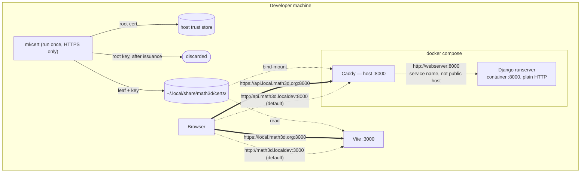

# 0005 — Local HTTPS development environment

**Status:** Accepted (2026-09-05)

**Contents**

- [Context](#context)
- [Decision](#decision)
  - [Two configurations, one topology](#two-configurations-one-topology)
  - [Names in /etc/hosts](#names-in-etchosts)
  - [A local CA](#a-local-ca)
  - [Terminating TLS](#terminating-tls)
  - [Configuration that moves](#configuration-that-moves)
  - [The Google client](#the-google-client)
  - [The CA private key](#the-ca-private-key)
  - [Keeping both paths honest](#keeping-both-paths-honest)
  - [The work](#the-work)
- [Consequences](#consequences)
- [Alternatives considered](#alternatives-considered)

## Context

[ADR-0004](0004-oauth-only-authentication.md) put sign-in behind Google and recorded that the flow cannot be exercised on the hostnames development uses: Google requires the host's TLD to be on the public suffix list and requires HTTPS outside bare `localhost`,[^origins] so `http://api.math3d.localdev:8000` fails on both counts. It named the two ways to run the real flow locally — both servers onto `localhost`, or TLS terminated locally for a domain math3d owns — and picked neither, because it did not have to: ordinary development authenticates through the `dummy` provider and never reaches Google. This ADR picks.

The constraints are identical under a redirect flow,[^redirect-uri] so a later popup-to-redirect migration does not reopen the choice.

Bare `localhost` is the cheaper option by a wide margin — no infrastructure, no code, one origin registered in the Google console.[^localhost-free] It does not work. Chrome 148 made cookies **origin-bound by default**: a cookie is bound to the port that set it, and the `Domain` attribute is the sanctioned opt-out.[^obc] `localhost` cannot take that opt-out. It is a single label, so the public suffix list's prevailing `*` rule makes it its own public suffix, and a `Domain` attribute equal to a public suffix is discarded and the cookie stored host-only. With the SPA on `localhost:3000` and the API on `localhost:8000`, Django's `csrftoken` is therefore set on `:8000`, returned to `:8000`, and invisible to `document.cookie` on `:3000`: `getCsrfToken()` in `packages/api/src/hooks/util.ts` yields the empty string, the client omits `X-CSRFToken`, and Django answers `CSRF token missing.` The rejected request is the provider POST — the one a sign-in test exists to exercise.

Nothing can be configured around it. The temporary enterprise policies Chrome shipped to revert the change stopped working in Chrome 150, which stable passed in mid-2026.

That closes the chain. Google accepts only HTTPS or bare `localhost`; bare `localhost` cannot carry a domain cookie; the CSRF token must be a domain cookie to cross the split between the SPA's port and the API's. The only origin satisfying both Google and our cookie topology is HTTPS on a multi-label name math3d controls. Nor can it be half-done: origin binding also binds scheme, and scheme has no `Domain` opt-out,[^obc] so an HTTPS SPA and a plain-HTTP API would fail to share cookies even setting aside mixed-content blocking. Both ends terminate TLS or neither does.

Throughout, the machine is macOS, and the Google integration referred to lands with ADR-0004's implementation rather than its ADR.[^provenance]

## Decision

**Local development gains an HTTPS configuration — `https://local.math3d.org:3000` for the SPA and `https://api.local.math3d.org:8000` for the API, on a certificate from a CA installed in the developer's own trust store. It is opt-in.** The committed default stays `http://math3d.localdev:3000` and `http://api.math3d.localdev:8000` authenticating through `dummy`, so a fresh clone needs no certificate to do ordinary work.

The two configurations are not two topologies. Caddy fronts Django in both, and every origin-derived setting follows `APP_BASE_URL`, so the difference between them is a scheme, a hostname, and a `tls` directive. CI runs both.



Four questions follow: why two configurations rather than one, how the names resolve, who signs the certificate, and who terminates TLS.

### Two configurations, one topology

Making HTTPS the only configuration would be tidier, and it is the version of this design that does not need a mode. It is rejected because it puts a step no agent can run in front of every kind of work: `mkcert -install` writes to the system keychain and prompts for administrator credentials, so a fresh machine could not start the app at all until a human was present. That is a poor trade for a capability wanted a few times a year.[^sudo-precedent]

What makes a rarely-used configuration tolerable is that it not be allowed to rot, and rot is the real hazard here: certificates, Caddy's `tls` directive, Vite's TLS branch, and Node's CA handling are the fragile parts, and under a naive opt-in they would be exercised only in the sessions that need them — which are, by construction, the sessions where something else is already being debugged. Two decisions address that.

**Caddy is always in the request path,** not gated behind a compose profile. In the default configuration it terminates nothing and simply reverse-proxies, which looks redundant and is not: it is what makes `X-Forwarded-Proto` real, so `SECURE_PROXY_SSL_HEADER` becomes a live mechanism in every developer's stack and on every CI run rather than a setting that only matters in the rare configuration. It also removes the conditional publishing of `webserver`'s host port, which is one fewer thing to get wrong.

**CI runs the suite in both configurations,** the HTTPS one against a certificate minted on the runner. See [Keeping both paths honest](#keeping-both-paths-honest).

One limit is worth stating plainly, because it is not fixable by configuration: **the two are mutually exclusive per machine.** `CSRF_COOKIE_DOMAIN` is a single Django setting with a single value, and `math3d.localdev` and `local.math3d.org` share no suffix, so one cookie cannot cover both. One backend container serves the main checkout and every worktree, so switching is machine-wide — a `docker compose up -d` to recreate (a container's environment is fixed at creation) plus a Vite restart, after which `.localdev` worktrees fail authenticated requests until it is switched back. The CORS, CSRF-trusted, and credentialed sets could be made to cover both at once — `CORS_ALLOWED_ORIGINS` is unioned into the dev origins and propagates to the other two — but the cookie cannot, so there is no point.

### Names in /etc/hosts

`local.math3d.org` and `api.local.math3d.org` resolve to loopback from the marker-delimited `/etc/hosts` block the setup script writes, alongside the `.localdev` names already documented in `README.md` — the same shape `ol-infrastructure/local-dev` maintains.[^ol-infra] All four names coexist; nothing has to be removed to switch. Each needs a `::1` line alongside `127.0.0.1`.[^ipv6]

Records in the Cloudflare zone would resolve the same names with nothing to install, and owning the zone is what makes that available to us where `lvh.me` and `localtest.me` are the same trick on domains we do not control. They are rejected anyway. The `sudo` line they would save already exists, in `README.md` and again in the E2E workflow, so the saving is two lines in a block a new machine writes regardless; hosts entries are machine-global and carry no ports, so worktrees never touch them under either scheme. Against that, a public name resolving to `127.0.0.1` is dropped by DNS-rebinding protection in some resolvers, consumer routers, and corporate VPNs — surfacing as NXDOMAIN for a name that demonstrably exists — and records put network reachability, and the state of a production DNS zone, in the path of local development. The one thing they uniquely enable is ACME DNS-01, which [A local CA](#a-local-ca) rejects on its own terms.

### A local CA

The certificate comes from a **mkcert CA installed in this machine's trust store**, not from a publicly trusted issuer:

```sh
mkcert -install   # once per machine; system keychain, admin prompt
mkcert -cert-file ~/.local/share/math3d/certs/local.math3d.org.pem \
       -key-file  ~/.local/share/math3d/certs/local.math3d.org-key.pem \
       local.math3d.org api.local.math3d.org
```

Let's Encrypt could issue over DNS-01 if the names were in the zone, but that buys the whole ACME apparatus for a host that only answers to loopback.[^acme]

One leaf covers both hostnames and therefore every port — ports are not part of a certificate — so the main checkout on `:3000` and worktree servers on `:3002`–`:3009` share it. It lives machine-global under `~/.local/share/math3d/certs/` rather than beside the code.[^certs-path]

### Terminating TLS

**Vite terminates its own TLS** via `server.https`. `packages/app/vite.config.ts` already parses `APP_BASE_URL` into an `appUrl` the `server` and `preview` blocks take host and port from, so the scheme joins them as a third derived value: read the certificate when `appUrl.protocol` is `https:`, and never otherwise. That branch must also be scoped to `command === "serve"` — the file is the vitest config too, and `yarn test` and `yarn build` run where no certificate exists.

Django gets Caddy, because `runserver` cannot terminate TLS and because production terminates at Heroku's router with Django reading `X-Forwarded-Proto` behind it. `SECURE_PROXY_SSL_HEADER` — today production-only — becomes a development setting unconditionally, since Caddy sets the header in both configurations. The consequence is about CSRF, not URL building: `CsrfViewMiddleware` composes its same-origin comparison from `request.is_secure()` and runs the strict `Referer` check _only_ for secure requests,[^csrf] so the header is what lets development reach production's branch at all.

One Caddyfile serves both configurations, parameterized by environment:

```
{$CADDY_API_SITE:http://api.math3d.localdev:8000} {
	{$CADDY_TLS:}
	reverse_proxy webserver:8000
}
```

The site address carries an explicit scheme in both cases: without it Caddy's automatic HTTPS would try to take over a plain-HTTP site.[^caddy-directives]

The upstream is the Docker service name, and that is load-bearing: inside a container the public name resolves to `127.0.0.1`, so `reverse_proxy api.local.math3d.org:8000` would proxy Caddy to itself. The same rule governs any server-side fetch from Django.

Caddy publishes host `:8000` in every configuration, so `webserver` publishes `8001:8000` instead — reachable for direct debugging, but no longer what `VITE_API_BASE_URL` names.

### Configuration that moves

The committed `.env.development` does not move. Enabling HTTPS means writing a block into the gitignored `.env`, which `setup_local_https.sh --enable` does rather than leaving it to be retyped:

```sh
APP_BASE_URL=https://local.math3d.org:3000
VITE_API_BASE_URL=https://api.local.math3d.org:8000
VITE_SITE_ORIGIN=https://local.math3d.org:3000
TEST_APP_URL=https://local.math3d.org:3000
TEST_API_URL=https://api.local.math3d.org:8000
CSRF_COOKIE_DOMAIN=local.math3d.org
CADDY_API_SITE=https://api.local.math3d.org:8000
CADDY_TLS=tls /certs/local.math3d.org.pem /certs/local.math3d.org-key.pem
```

`CSRF_COOKIE_DOMAIN` is `local.math3d.org` and not `math3d.org`, which the validator would also accept while attaching development cookies to production requests. The CORS, CSRF-trusted, and credentialed origins in `webserver/main/origins.py` all trace back to `APP_BASE_URL`, so they follow for free, worktree ports included. Two consumers do not. The development `ALLOWED_HOSTS` default in `webserver/main/settings.py` gains `api.local.math3d.org` alongside `api.math3d.localdev` — Caddy preserves the incoming `Host`, so Django would otherwise reject every API request with `DisallowedHost`. And the two `CADDY_*` values are read by compose interpolation, so they belong in the project-root `.env` specifically.[^compose-env]

Trust does not follow the configuration either. **Node does not read the macOS trust store by default.** Playwright's `webServer` readiness probe, `global.setup.ts`'s `request.get`, and — the one no Playwright option reaches — the bare `fetch` calls in `packages/app-tests-e2e/src/utils/api/config.ts` all validate against Node's bundled CA bundle. The fix goes on the `test-e2e` script, which already wraps Playwright in a `node` invocation: `--use-system-ca` on the pinned Node 24, or `NODE_EXTRA_CA_CERTS="$(mkcert -CAROOT)/rootCA.pem"`. `ignoreHTTPSErrors` is not the fix — it would discard the trust this design exists to establish. Playwright's Chromium needs nothing on macOS, because it reads the keychain.[^chromium]

### The Google client

A **dev-only OAuth client**, in the same Google Cloud project as production. Separate client because development origins churn, and every such edit would otherwise touch the client real users authenticate against. Same project because the consent screen, its branding, and its publishing status are per-project. Authorized JavaScript origins list `https://local.math3d.org:3000` and each of `:3002`–`:3009`; non-standard ports are permitted in a JavaScript origin,[^origins] so no privileged bind is needed and worktrees register on the same terms as the main checkout. No redirect URI and no client secret, per ADR-0004 — the popup flow obtains no authorization code, so neither field has a consumer.

### The CA private key

A trusted root's private key mints certificates for _any_ hostname this machine accepts silently. Live malware running as the user is game-over regardless; backup exposure — a stolen disk, a compromised backup provider — needs no code execution, and is the case worth designing against.

So the setup **deletes `rootCA-key.pem` once the leaf is issued**:

```sh
rm "$(mkcert -CAROOT)/rootCA-key.pem"
```

`rootCA.pem` stays put — in the trust store and on disk at `$(mkcert -CAROOT)`, the path `NODE_EXTRA_CA_CERTS` needs. Nothing sensitive on disk means nothing to exclude from backups and nothing to rotate. The cost is that issuance becomes one-shot: adding a third hostname later is a full CA rotation — new CA, re-trust, reissue — not another `mkcert` run. That is the same work the leaf's roughly two-year lifetime forces anyway.

### Keeping both paths honest

The E2E workflow gains a second job running the same suite against the HTTPS origins. It mints its own CA rather than receiving one: on a Linux runner `mkcert -install` is non-interactive, so the job installs `libnss3-tools`, runs `mkcert -install`, issues a leaf for the two hostnames into the path compose bind-mounts, writes the HTTPS block into `.env`, and runs `yarn test-e2e` exactly as the HTTP job does. Nothing is stored and nothing rotates; the CA lives and dies with the runner.[^ci-https]

This is what makes the opt-in acceptable rather than merely convenient. Without it, the configuration carrying the certificate, the `tls` directive, the Vite TLS branch, and the Node CA flag would be exercised only when someone reached for it, which is the worst possible moment to discover it broke. With it, both paths fail on the pull request that breaks them.

### The work

- **A new `scripts/setup_local_https.sh`,** not an extension of `setup_worktree_env.sh`, which refuses to run outside a worktree. It creates the certs directory, writes the `/etc/hosts` block, runs the two `mkcert` commands, deletes the root key, and under `--enable` writes the HTTPS block into `.env`.
- **A `caddy` service in `docker-compose.yml`,** unconditional, publishing `8000:8000` and bind-mounting the Caddyfile and the certs directory; `webserver` moves to `8001:8000`.
- **`SECURE_PROXY_SSL_HEADER` in the development branch** of `settings.py`, and `api.local.math3d.org` into the development `ALLOWED_HOSTS` default.
- **Vite `server.https`,** conditional on an https `APP_BASE_URL` and on `command === "serve"`.
- **`--use-system-ca` on the `test-e2e` script.**
- **A second E2E job** per [Keeping both paths honest](#keeping-both-paths-honest).
- **`scripts/setup_worktree_env.sh` derives the origin** from the checkout's own environment rather than hardcoding `math3d.localdev`, and its claimed-port scan does the same — it currently greps the literal `math3d.localdev:[0-9]+`, which would find nothing in a worktree written under HTTPS.
- **Development cookie flags stay `False`** even over TLS, and the `DISABLE_ALLAUTH_RATE_LIMITS` guard stays as it is.[^cookie-flags]
- **The dev client ID is committed to `.env.development`,** replacing the placeholder, so the button works from the setup script alone.[^client-id]
- **`README.md`** gains the HTTPS section; the existing hosts and setup steps stay as they are.

## Consequences

- **Nothing changes for a fresh clone or for daily work.** The committed configuration is the one that exists today, `dummy` included, and no certificate is needed to run the app, the suite, or a worktree.
- **Caddy joins every stack, including CI's.** The proxy topology and `X-Forwarded-Proto` become the tested default rather than a rare configuration — at the cost of one more container that can fail during ordinary work, and of `webserver` moving to host port 8001, so anything reaching Django directly at `:8000` now reaches Caddy instead.
- **Turning HTTPS on is a script run plus a human `mkcert -install`.** The administrator prompt is unavoidable and not automatable, so an agent cannot enable HTTPS unattended — but it also cannot block one, since it gates nothing else.
- **The two configurations are mutually exclusive per machine.** Switching is `docker compose up -d` plus a Vite restart, and while HTTPS is in effect the `.localdev` worktrees cannot authenticate. Tolerable only because the switch is deliberate and brief.
- **CI grows a second E2E job,** roughly doubling that workflow's runtime, in exchange for both configurations failing on the pull request that breaks them.
- **The developer's certificate expires silently, roughly two years out.** A missing certificate fails the dev server loudly; an expired one starts fine and fails only in the browser, with no reminder. CI is immune, minting fresh each run. Adding a third hostname before then is a full CA rotation rather than another `mkcert` run.
- **Production's CSRF branch is exercised in the HTTPS configuration only.** `request.is_secure()` is false under the default, as today, so the strict `Referer` check runs locally only when HTTPS is on — and on the HTTPS CI job, which is where it is actually pinned.
- **The Google console holds ten origins outside the repo,** one per port, discoverable only by failing.
- **ADR-0004 opened production registration partly because the Google flow could not run locally.** It can now. Whether `ENABLE_REGISTRATION` should close again is a separate decision this ADR does not make.

## Alternatives considered

- **Bare `localhost` for both servers.** Free, and the option ADR-0004 named first. Rejected because it does not work: with cookies origin-bound by default since Chrome 148 and `Domain=localhost` unavailable, the SPA on `:3000` cannot read the CSRF token the API sets on `:8000`, and the sign-in POST is rejected.[^obc] There is no supported way to opt out — the enterprise policies expired in Chrome 150.
- **Make HTTPS the only configuration,** retiring `math3d.localdev`. Tidier, and it needs no mode: one hostname set for daily work, the suite, and sign-in. Rejected because `mkcert -install` would then gate a cold clone for _every_ kind of work behind a human with administrator rights, to buy a capability wanted a few times a year. The argument for it was that a rarely-used path rots; [Keeping both paths honest](#keeping-both-paths-honest) answers that directly, which is what makes the opt-in defensible rather than merely cheaper.
- **Disable CSRF in development,** as an env-guarded branch in `settings.py`, alongside `localhost` origins. It would work: `getCsrfToken()` is the app's only `document.cookie` read, `sessionid` is host-only on the API's own port and travels fine, and allauth's headless views apply no CSRF enforcement of their own. Rejected on fidelity rather than danger — the token here is defense in depth, not the load-bearing control[^csrf-depth] — but the one manual Google test would then run on a `localhost` origin, with a host-only cookie instead of a domain cookie, with CSRF off: three deviations stacked in exactly the layer the test exists to inspect. What it would confirm is that Google returns an ID token and allauth accepts it, which the E2E suite already establishes through `dummy` on the same `provider/token` endpoint.
- **Move the CSRF token out of the cookie,** to a dedicated endpoint or `CSRF_USE_SESSIONS`. Rejected: it changes how every authenticated write works in production so that one local configuration can exist. This design changes only local development.
- **Hand-test Google on a deployed instance instead.** `next.math3d.org` has real HTTPS, a real client, and the real cookie topology, and ADR-0004 already assumes as much. But it is the live instance, not a staging one, so this means first-exercising sign-in in production on the same change that opens registration — and a separate RC instance is $10–20 a month, recurring, against a one-time local build. Each iteration would also cost a deploy, with no way to attach a debugger.
- **A tunnel (`cloudflared`, `ngrok`).** The strongest infrastructure alternative — a trusted certificate, no local CA, no trust install, reachable from a phone, on infrastructure math3d already uses.[^cf-tunnel] Rejected because every request including HMR round-trips Cloudflare, the dev server becomes internet-reachable absent Access, each worktree port needs its own hostname and ingress rule, and TLS would terminate at an edge production does not have — `api.math3d.org` is a Heroku CNAME, not proxied. Ephemeral `ngrok` hostnames would also need re-registering as a Google origin each session. Reach for this if a device that cannot install a root certificate needs in.
- **Public DNS records instead of `/etc/hosts`.** Rejected; see [Names in /etc/hosts](#names-in-etchosts).
- **Gate Caddy behind a compose profile,** so the default stack is unchanged. Rejected: it would leave the proxy hop, `X-Forwarded-Proto`, and `SECURE_PROXY_SSL_HEADER` exercised only in the rare configuration, and would reintroduce conditional publishing of `webserver`'s host port. The redundant hop in the default configuration is the price of the mechanism being real.
- **Proxy the API through Vite** (`server.proxy`) — one origin, one terminator, no Caddy. The standard Vite pattern, and the obvious simplification. Rejected because it collapses the SPA/API origin split, so `CSRF_COOKIE_DOMAIN`, the cross-origin CORS path, and the credentialed-origin machinery all stop being exercised in development — the very arrangement ADR-0004 has development mirroring from production, and the one whose breakage under `localhost` is why this ADR exists.
- **Put the SPA behind Caddy too,** for a single terminator, deleting Vite's certificate branch. Rejected because two terminators is the faithful mirror, not an accident: in production the browser reaches the SPA at a CDN and the API at `api.next.math3d.org`, terminated by Heroku's router and forwarded to the dyno internally.
- **Shared loopback domains** — `lvh.me`, `localtest.me`, `nip.io`/`sslip.io`,[^sslip] and `localhost.direct`,[^lhd] which publishes a publicly trusted wildcard certificate _and its private key_. Rejected for the same reason as bare `localhost` — no ownership, so no claim to be the environment we test — plus: a published private key lets anyone on the same network MITM every `*.localhost.direct` host with a publicly trusted certificate.
- **Caddy's own local CA** (`tls internal` + `caddy trust`).[^caddy-internal] The same mechanism on a service already running. Rejected because leaves are generated per-SNI inside Caddy's PKI rather than as files Vite can be handed, and `caddy trust` installs into the trust store of wherever it runs — for a containerized Caddy, the container's — leaving the only hard step manual anyway.
- **`vite-plugin-mkcert`.**[^vite-mkcert] Rejected: it covers the SPA only, and manages a per-project certificate rather than the machine-global one Caddy also mounts.
- **A publicly trusted certificate via DNS-01.** Rejected; see [A local CA](#a-local-ca).
- **`runserver_plus --cert-file` (`django-extensions`).** No new service and no `SECURE_PROXY_SSL_HEADER` — which is the objection. Rejected because production runs Django behind a TLS-terminating router reading forwarded headers, and this diverges from that topology to save a container.
- **A name-constrained CA.** X.509 `nameConstraints` limiting the root to `.math3d.org` would reduce "can forge anything" to "can forge our own dev hostnames". Rejected: mkcert cannot generate one, and enforcement on user-added roots is unverified with a silent fallback. Deleting the private key addresses the same threat with no new tooling.

[^obc]: [Chrome Platform Status — Origin-Bound cookies (by default)](https://chromestatus.com/feature/4945698250293248): "In Chrome 148, cookies are bound to their setting origin (by default) such that they're only accessible by that origin… Cookies might ease the host and port binding restrictions through use of the `Domain` attribute but all cookies will be bound to their setting scheme." The temporary `LegacyCookieScopeEnabled` and `LegacyCookieScopeEnabledForDomainList` policies "will stop working in Chrome 150"; Chrome 148 reached stable on 2026-05-05. The [explainer](https://github.com/sbingler/Origin-Bound-Cookies/blob/main/README.md) states that domain cookies "are allowed to be accessed by any port".
[^csrf-depth]: Neither cookie sets a SameSite value, so Django's `Lax` default applies to both — a cross-site POST carries no `sessionid` at all — and the JSON content type forces a preflight the attacker's origin fails. CORS itself is not the defense: it gates reading the response, not sending the request. What the token still covers is same-site attackers, since SameSite is site-scoped and `CSRF_COOKIE_DOMAIN` widens the cookie to every `math3d.org` subdomain, plus any handler that parses a body without checking its content type.
[^sudo-precedent]: Setup is not automatable today either — `README.md` opens with a `sudo … >> /etc/hosts` step no agent can run — so this is a difference of degree. The degree still matters: the hosts block is written once and never again, while a certificate expires and can need reissuing on a machine that was working yesterday.
[^localhost-free]: The development `ALLOWED_HOSTS` default in `webserver/main/settings.py` already lists `localhost`; the development CORS origins are computed from `APP_BASE_URL` in `webserver/main/origins.py`, with the CSRF-trusted and credentialed sets derived from those; and `EnvConfig._csrf_cookie_domain_must_cover_spa_host` skips its check when `CSRF_COOKIE_DOMAIN` is empty.
[^provenance]: The `VITE_GOOGLE_CLIENT_ID` build variable, the `dummy` provider the E2E suite authenticates through, and the `provider/token` endpoint are not greppable in a tree carrying only the ADRs. Trust-store mechanics are the part of this that would differ off macOS.
[^ol-infra]: `ol-infrastructure/local-dev` maintains a marker-delimited `/etc/hosts` block for its `mit.dev` names; a hosts file has no wildcards, so its eight hostnames are enumerated by hand, as the four here would be.
[^ipv6]: Today's block carries `::1` lines for both `.localdev` names, and `scripts/setup_worktree_env.sh` probes both loopbacks on the stated grounds that dev servers commonly bind only `::1`.
[^acme]: A Cloudflare API token with edit rights on the production zone, a custom Caddy build carrying a DNS solver (the stock image has none), 90-day renewals that fail silently on a closed laptop, and a real private key in the working tree for `detect-secrets` to keep finding.
[^certs-path]: A gitignored `certs/` beside the code would mean one mkcert run per checkout, and a worktree that skipped it fails at dev-server start for a reason that looks nothing like its cause.
[^caddy-directives]: Both the environment substitution and an empty `{$CADDY_TLS:}` expanding to no directive are Caddyfile details worth one `docker compose up` to confirm before relying on them; a static two-site Caddyfile is not an option, since a single port cannot serve both a TLS and a plain-HTTP site.
[^compose-env]: Compose interpolation reads the project-root `.env` and the shell — never the `env_file:` list, which is a different mechanism. The other values in the block are read by Django and Vite through `env_file`/direnv, which read the same file, so one file still carries the whole switch.
[^chromium]: Linux Chromium reads NSS rather than the system bundle, which is why the CI job installs `libnss3-tools` before `mkcert -install`. Both statements hold only while `playwright.config.ts` runs Chromium alone; a WebKit or Firefox project would need revisiting.
[^ci-https]: **Assumed, not yet verified:** that `mkcert -install` plus `libnss3-tools` satisfies Playwright's bundled Chromium on an Ubuntu runner. The mechanism is standard, but it should be confirmed on a branch before the second job is relied on. If it does not hold, the alternative is to make HTTPS the only configuration and accept the `mkcert -install` gate, since the rot argument would then have no answer.
[^cookie-flags]: Deriving them from the scheme would mirror production more exactly, but `Secure` is a browser-side send restriction that no code branches on, so it buys no bug class — and it would force re-keying the `DISABLE_ALLAUTH_RATE_LIMITS` guard, which reads `SESSION_COOKIE_SECURE` as a proxy for "this is production".
[^client-id]: A client ID is public by construction, and its only security property is the origin allowlist, whose entries all resolve to loopback. It cannot reach a production build: Vite loads `.env.development` only in development mode, and the deploy workflow supplies `VITE_GOOGLE_CLIENT_ID` from an Actions variable regardless.
[^origins]: [Google Cloud — Manage OAuth Clients](https://support.google.com/cloud/answer/15549257), on authorized JavaScript origins: the TLD must be on the public suffix list, HTTPS is required outside `localhost`, and "if you use a port other than 80, you must specify it. For example: `https://example.com:8080`".
[^redirect-uri]: [Google — Using OAuth 2.0 for Web Server Applications](https://developers.google.com/identity/protocols/oauth2/web-server): "Redirect URIs must use the HTTPS scheme, not plain HTTP. Localhost URIs (including localhost IP address URIs) are exempt from this rule", and "Host TLDs (Top Level Domains) must belong to the public suffix list."
[^csrf]: [`django/middleware/csrf.py:278-279`](https://github.com/django/django/blob/6.0.7/django/middleware/csrf.py#L278-L279) in Django 6.0.7, the pinned version — `good_origin` is built from `request.is_secure()`; the `Referer` fallback runs under [`elif request.is_secure():`](https://github.com/django/django/blob/6.0.7/django/middleware/csrf.py#L442).
[^cf-tunnel]: [Cloudflare — Create a locally-managed tunnel](https://developers.cloudflare.com/cloudflare-one/networks/connectors/cloudflare-tunnel/do-more-with-tunnels/local-management/create-local-tunnel/).
[^sslip]: [nip.io](https://nip.io/) / [sslip.io](https://sslip.io/) — wildcard DNS returning the IP encoded in the hostname.
[^lhd]: [`Upinel/localhost.direct`](https://github.com/Upinel/localhost.direct).
[^caddy-internal]: [Caddy — Automatic HTTPS](https://caddyserver.com/docs/automatic-https#local-https).
[^vite-mkcert]: [`vite-plugin-mkcert`](https://github.com/liuweiGL/vite-plugin-mkcert).
