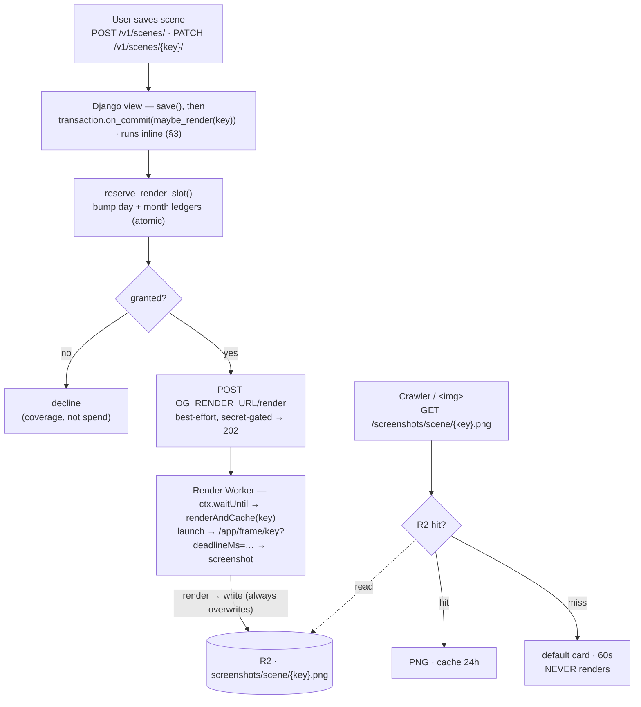

# Screenshot rendering: generate-on-POST + cost protection — design

Implements **ADR-0002** (`docs/adr/0002-browser-rendering-cost-protection.md`) — read it first for the decision and priorities. This spec is the implementation.

**Goal:** Replace the free-tier lazy render-on-fetch with a backend-gated render-on-create/edit, plus a hard spend cap (legitimate path), a hard per-render duration bound, a velocity damper, and a budget tripwire.

**Prerequisite:** Stacks on the ADR-0001 rename (`/og/…` → `/screenshots/…`, R2 prefix `og/` → `screenshots/`, thumbnail consumers) — ship that first. Paths below are post-rename.

**Priorities (ADR-0002, governs every trade-off):** (1) bounded spend; (2) tied — simplicity/reliability and first-share-shows-an-image; (3) minimize spend ($5 ideal, $10 max); (4) universal coverage (sacrificable).

---

## Architecture & data flow



Backend is the **sole gatekeeper** of the legitimate path: `renders ≤ reservations ≤ cap`.

---

## Config

| Name                  | Where               | Value                     | Meaning                                                             |
| --------------------- | ------------------- | ------------------------- | ------------------------------------------------------------------- |
| `RENDER_MONTHLY_CAP`  | `settings.py` const | `1500`                    | Max reservations / UTC month.                                       |
| `RENDER_DAILY_CAP`    | `settings.py` const | `150`                     | Max reservations / UTC day (anti-burst).                            |
| `OG_RENDER_URL`       | `EnvConfig` (env)   | Worker origin, `https://` | Nudge base. Unset ⇒ feature dark.                                   |
| `RENDER_SECRET`       | `EnvConfig` (env)   | shared secret             | Gates `POST /render`. Reuse an existing secret.                     |
| `RENDER_DEADLINE_MS`  | Worker var          | `60000`                   | Overall render bound, enforced in `renderScene` (§9).               |
| `PAGE_DEADLINE_MS`    | Worker var          | `70000`                   | Frame-page wall-clock ceiling; > deadline ⇒ fires only for orphans. |
| `MAX_SESSION_SECONDS` | derived             | `≈130`                    | `PAGE_DEADLINE_MS` + CF idle-reap (~60s); confirm empirically.      |

Caps are plain `settings.py` constants (rarely change, not secret). `OG_RENDER_URL` and `RENDER_SECRET` go through the typed `main/env.py` `EnvConfig`; `OG_RENDER_URL` gets an `https://`-origin validator (like `APP_BASE_URL`) so the bearer secret isn't sent cleartext. <!-- pragma: allowlist secret -->

`RENDER_MONTHLY_CAP` derivation: ≤ $10 = $5 base + ≤ $5 overage ≈ 55.6 overage + 10 included ≈ 65.6 browser-hours; at `MAX_SESSION_SECONDS` that's ≈1800 sessions; `1500` is conservative headroom. (Refines ADR-0002's illustrative 1900/120s — the duration bound in §9 lands the ceiling near 130s.) Calendar-vs-billing-cycle straddle is self-correcting (annual spend stays ≤ `12 × cap`); no logic.

---

## Backend

### 1. Reservation ledgers + migration — `scenes/models.py`

One row per period; the row **is** the historical usage record — no singleton, no rollover-reset:

```python
class RenderDay(models.Model):
    day = models.DateField(primary_key=True)      # UTC
    count = models.PositiveIntegerField(default=0)
    modified = models.DateTimeField(default=timezone.now)  # bumped by the reservation SQL (auto_now won't fire — no .save())

class RenderMonth(models.Model):
    month = models.DateField(primary_key=True)    # first-of-month, UTC
    count = models.PositiveIntegerField(default=0)
    modified = models.DateTimeField(default=timezone.now)  # ditto
```

Migration is `CreateModel` only — no seeding; a period's row is created on its first reservation. `RenderMonth` rows are kept indefinitely (≈12 tiny rows/year = the usage history a singleton would overwrite); `RenderDay` rows are equally tiny — keep them (free daily history) or prune via an optional management command. Register both in `scenes/admin.py` (repo convention; direct ops visibility into current usage). `count` is the unambiguous per-period usage record; whether a period was _saturated_ is only meaningful against the cap then in force — we don't store a per-row cap (YAGNI), so post-cap-change saturation analysis is approximate.

### 2. `reserve_render_slot() -> bool` — `scenes/screenshots.py`

Grant iff **both** the current day and month are under cap; bump both, all-or-nothing, in one short transaction. A missing period row is created at `1` (implicit rollover). Each upsert's `WHERE count < cap` makes the cap atomic under the row lock; the transaction rolls back the month bump if the day is over cap (both-or-neither). Concurrent callers serialize month-then-day → no deadlock, no over-grant.

```python
# Raw SQL is deliberate: no ORM idiom expresses insert-or-increment-only-if-
# under-cap in one atomic round-trip (update_or_create is select-then-write;
# bulk_create update_conflicts has no WHERE). Do NOT "simplify" to the ORM.
_MONTH_SQL = """
    INSERT INTO scenes_rendermonth (month, count, modified) VALUES (%(period)s, 1, now())
    ON CONFLICT (month) DO UPDATE SET count = scenes_rendermonth.count + 1, modified = now()
    WHERE scenes_rendermonth.count < %(cap)s
    RETURNING count
"""
_DAY_SQL = """
    INSERT INTO scenes_renderday (day, count, modified) VALUES (%(period)s, 1, now())
    ON CONFLICT (day) DO UPDATE SET count = scenes_renderday.count + 1, modified = now()
    WHERE scenes_renderday.count < %(cap)s
    RETURNING count
"""

def _bump(sql: str, period, cap: int) -> bool:
    with connection.cursor() as cur:
        cur.execute(sql, {"period": period, "cap": cap})
        return cur.fetchone() is not None

def reserve_render_slot() -> bool:
    today = timezone.now().date()          # UTC (USE_TZ, TIME_ZONE=UTC)
    month = today.replace(day=1)
    with transaction.atomic():
        if not _bump(_MONTH_SQL, month, settings.RENDER_MONTHLY_CAP):
            return False                     # over monthly cap (nothing changed)
        if not _bump(_DAY_SQL, today, settings.RENDER_DAILY_CAP):
            transaction.set_rollback(True)   # undo the monthly bump
            return False
        return True
```

### 3. `maybe_render()` — reservation + nudge, fully isolated

These views run in autocommit (no `ATOMIC_REQUESTS`/`@transaction.atomic`), so `on_commit` runs **inline, synchronously, before the response**, with `robust=False`. Any exception would otherwise 500 the save, so the **whole body** is isolated. (This autocommit assumption is load-bearing — `ATOMIC_REQUESTS` would defer the nudge to request-commit and make reserve's `atomic()` a savepoint; a documented invariant, not guarded by a test.)

```python
def maybe_render(key: str) -> None:
    try:
        if not settings.OG_RENDER_URL:      # feature dark
            return
        if not reserve_render_slot():        # over cap → decline (coverage, not spend)
            return
        nudge_render(key)
    except Exception:
        logger.warning("maybe_render failed for key=%s", key, exc_info=True)
```

Running inline, the ≤2s nudge timeout (§4) lands on that save's latency — acceptable for v1 (a daemon thread is deferred).

### 4. `nudge_render()` — transport

Stdlib `urllib.request` (no new dep); best-effort, ~2s timeout, no retry:

```python
def nudge_render(key: str) -> None:
    req = urllib.request.Request(
        f"{settings.OG_RENDER_URL}/render",
        data=json.dumps({"key": key}).encode(),
        headers={"content-type": "application/json",
                 "authorization": f"Bearer {settings.RENDER_SECRET}"},
        method="POST",
    )
    urllib.request.urlopen(req, timeout=2.0).close()
```

The Worker returns 202 immediately (§6), so this is normally <200ms.

### 5. Wiring — `scenes/api.py`

In both `create_scene` and `update_scene`, after `scene.save()`:

```python
transaction.on_commit(lambda: maybe_render(scene.key))
```

These are the only `Scene.save()` paths. `create_legacy` writes no image; legacy migration-on-GET is an accepted coverage gap. No other trigger site.

---

## Render Worker

### 6. `POST /render` — secret-gated nudge — `packages/og-render/src/index.ts`

- `Authorization: Bearer <RENDER_SECRET>` else `403` **before** `browser.launch`.
- Parse `{key}`, validate against `KEY_RE`, else `400`.
- `ctx.waitUntil(renderAndCache(env, key))`, return `202` immediately.

Add `RENDER_SECRET`, `RENDER_DEADLINE_MS`, `PAGE_DEADLINE_MS` to `env.ts`.

### 7. `GET /screenshots/scene/{key}.png` — pure cache-serve

Hit → PNG (`max-age=86400`); miss → default card (`max-age=60`), nothing else. No `scheduleRender`, no lock, no existence gate. Cache-read failure still degrades to the default card (never 500s).

### 8. Delete the lazy machinery

- Remove `lock.ts` + `lock.spec.ts` (single-flight was for the crawler race).
- Remove the `/meta/` existence gate (`sceneExists`) from `renderAndCache` — the backend only nudges scenes it persisted. Keep the swallow-everything outer try/catch. **The `/meta/` _endpoint_ stays** — the app Worker (`worker/index.ts` `fetchTitle`) still uses it for `og:title`.
- **Accepted trade:** a bogus/deleted key now burns a full render up to the deadline instead of a cheap `/meta/` 404 — bounded by caps + secret + WAF.
- **No dedup in v1:** two rapid saves → two renders. The global counter has no per-user/scene dedup, so one client mashing save can exhaust `RENDER_DAILY_CAP` for everyone — a **coverage** DoS (never spend), invisible to the per-IP WAF. Deferred.

### 9. Render duration bound (authoritative)

The bound must **close the browser** at the deadline, so it lives **inside `renderScene`** (a `Promise.race` in the caller would let the loser run while `browser.close()` waits on it):

```ts
export const renderScene = async (
  env,
  key,
  deadlineMs,
): Promise<Uint8Array> => {
  const browser = await puppeteer.launch(env.BROWSER);
  try {
    return await withTimeout(deadlineMs, async () => {
      const page = await browser.newPage();
      await page.setViewport({
        width: 1200,
        height: 630,
        deviceScaleFactor: 1,
      });
      await page.goto(sceneFrameUrl(env, key), {
        waitUntil: "networkidle0",
        timeout: NAV_TIMEOUT_MS,
      });
      await page.waitForSelector(READY_SELECTOR, { timeout: READY_TIMEOUT_MS });
      return page.screenshot({ type: "png" });
    });
  } finally {
    await browser.close(); // runs on timeout too → closes at ~deadlineMs, aborting the hung op
  }
};
```

`RENDER_DEADLINE_MS = 60_000` ties to the validated 60s frame-render e2e budget; it's authoritative, with `NAV_TIMEOUT_MS`/`READY_TIMEOUT_MS` as per-step guards under it (lower `NAV` 30s → 15s). Residual: `launch`/`close` are themselves unbounded — the page deadline (§10) + CF idle-reap is the ultimate backstop.

---

## 10. Frame page — `?deadlineMs` wall-clock self-halt

`still` mode already halts at `STILL_MAX_FRAMES` (a _frame_ backstop); add a **wall-clock** ceiling so an orphaned session (Worker died before `close`) goes CPU-idle at a known time — the quantity that maps to billed browser-seconds.

- `routes.tsx` → `FramePage` reads `?deadlineMs`, passes it to `Scene`.
- In the still-mode RAF loop (`Scene.tsx`), if `performance.now() - start > deadlineMs`, force `stop()` + latch ready (same halt path as drain completion).
- The Worker appends `?deadlineMs=${PAGE_DEADLINE_MS}` (`keys.ts` `sceneFrameUrl`); since `PAGE_DEADLINE_MS > RENDER_DEADLINE_MS > READY_TIMEOUT`, it fires only for a true orphan.

---

## 11–13. Rate limiting + tripwire (Cloudflare, user-provisioned)

Values documented here; provisioned in Cloudflare. Only the wrangler route is code.

- **Custom domain:** move the render Worker to `screenshots.math3d.org` (wrangler `routes`) so a zone WAF rule sees its traffic.
- **One WAF rule (velocity damper):** scoped to the **render nudge** — `POST` on the render path, not hostname-wide (same host serves the high-volume `GET …png`). E.g. 20 req / 10s per IP → block. Fits the free zone's single-rule allowance. _Limits:_ legit nudges share the backend IP (fine — reservation already bounds them to ≈150/day); a distributed leaked-secret attack stays under a per-IP threshold, so this damps single-IP bursts only, with the budget alert as backstop.
- **Budget alert:** CF budget alert on Browser Rendering spend at a low threshold.

---

## The leaked-secret boundary

The reservation bounds only the legitimate backend path. An attacker holding `RENDER_SECRET` calls `POST /render` directly, bypassing it — bounded then only by the WAF damper (weak against distribution) + budget-alert reaction, not a hard cap. This is ADR-0002's accepted `[^secret]` position (a hard cap would need a per-render budget round-trip, rejected). The Goal's "no unbounded-spend risk" is scoped to normal traffic.

---

## Testing

**Backend (`scenes/screenshots_test.py`):** `reserve_render_slot` — grants comfortably under both caps; **cap boundary** per ledger (seed a row at `count = cap-1`: reserve → `True`, `count == cap`; reserve again → `False`, `count` unchanged — pins `<` vs `<=`); creates a fresh day/month row on a new period (count → 1) while retaining the prior month's row as history; rolls back the month bump when the day cap is hit (both-or-neither); **concurrency** — a `TransactionTestCase` with N threads/connections hammering a `cap-1` boundary asserts exactly `cap` total grants (the load-bearing no-over-grant invariant). `maybe_render` nudges only when granted, returns early when `OG_RENDER_URL` unset, and **swallows a `reserve_render_slot` exception so the save still returns 2xx** (the §3 inline-isolation property — use a harness where `on_commit`/`atomic` behave as in production, not a plain savepoint-wrapped test); `nudge_render` swallows transport errors; `create_scene`/`update_scene` register the `on_commit` nudge.

**Worker (`index.spec.ts`):** `POST /render` — valid secret → 202 + render scheduled; bad/missing secret → 403 + no `browser.launch`; invalid key → 400. `GET …png` — hit → PNG+24h; miss → default card+60s, **no** render. Deadline: work exceeding `RENDER_DEADLINE_MS` rejects **and `browser.close()` is called**.

**Frame page:** with `?deadlineMs` (fake timers), the still loop force-halts at the bound — `stop()`, `data-scene-ready` latched, RAF stopped — even if drain never completes.

---

## Out of scope / deferred

- **Out of scope (ADR-0001):** the `/og/`→`/screenshots/` rename + thumbnail consumers.
- **Deferred (ADR-0002):** outbox+cron heal for dropped nudges; per-IP app-layer throttle + per-scene/user dedup; Billable-Usage reconciliation; raising `RENDER_MONTHLY_CAP` after an empirical idle-reap measurement; daemon-thread nudge.
