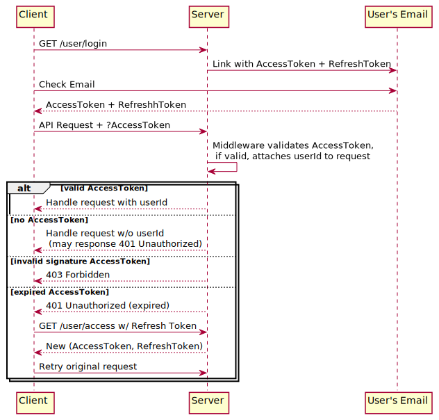
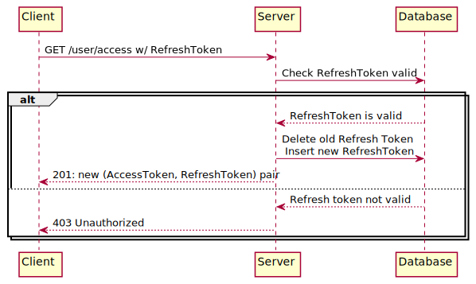
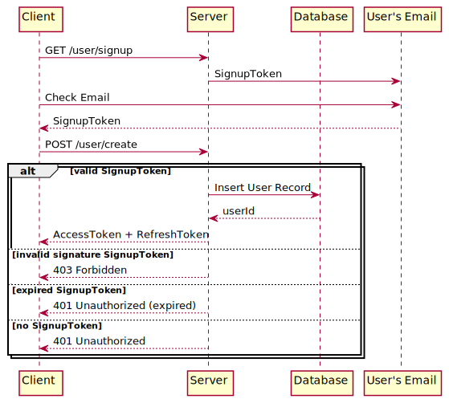

# Authentication

- [Authentication](#authentication)
  - [Overview](#overview)
  - [General Request Authentication](#general-request-authentication)
  - [RefreshTokens](#refreshtokens)
  - [User Creation](#user-creation)

## Overview

Math3d uses passwordless, "magic link" authentication. Once an account is created, users can log into their accounts by entering their email address. At this point, Math3d will email the user a secret "magic link" containing an AccessToken. Clicking the link will redirect the user to the Math3d site and store the AccessToken in their browser's LocalStorage. Subsequent requests to the Math3d backend include the AccessToken (in the Authorization header) for authentication.

## General Request Authentication

Some requests—such as fetching an existing public graph—do not require authentication. Others, like editing or deleting existing graphs, do require authentication.

The AccessTokens are user-specific and include the user's userId. When a request includes an AccessToken, server middleware verifies the token signature and attaches the token's userId to the request for subsequent use by route handlers.

Requests that do not require authentication may still provide different responses if they are sent using an AccessToken. For example, `GET /graph/:graphId`, might include a `{ canEdit: boolean }` where the value of `canEdit` is `true` if and only if the request was sent with an AccessToken for the user with edit priveleges on that graph.

AccessTokens do expire. If a request is sent with an expired AccessToken is sent, a 401 Unauthorized response indicates that the client should try again after requesting a fresh AccessToken using their RefreshToken. This process is described below.

This general authentication flow is shown below.

_Note:_ If a request is sent with a token using an invalid signature, we'll respond 403 Forbidden even if the route does not require authentication.

## RefreshTokens

The AccessTokens used by Math3d are Json Web Tokens (JWTs), signed by the Math3d backend using its secret key. The JWTs are also validated by the backend using the secret key. The secret key is stored in memory allowing tokens to be issued and verified without database access.

Once issued, a single JWT cannot be revoked. As such, we set the JWTs to expire after a relatively short time (say, 30 minutes). In order that the user not need to login every 30 minutes, the secret link also includes a RefreshToken that can be used to request new AccessTokens.

A RefreshToken can only be used once to request a new AccessToken. Unlike the JWT AccessTokens, RefreshTokens are simple random strings (e.g., UUIDs) stored in the database. When a RefreshToken is used, the backend server checks the database to ensure it is valid. The server then invalidates the token in the database and create both a new RefreshToken (in database) and signs a new AccessToken. The new (AccessToken, RefreshToken) pair is sent to the frontend.

## User Creation

To initially create a Math3d account, users use a similar email-based scheme. To request account creation, users submit their email address and the backend emails them a magic link including a SignupToken. The link redirects the user to an account creation page where further account details (e.g., username) can be entered.

_Note:_ If account creation is requested for an email address already registered, the backend server will send an email variant including a login link (AccessToken + RefreshToken) rather than a SignupToken.
